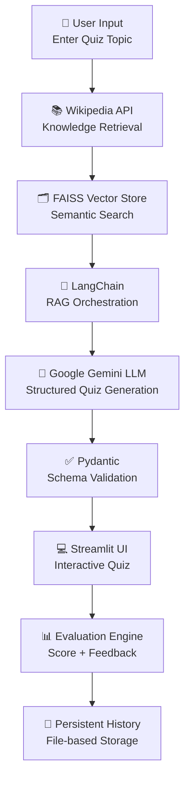

#This is the Screenshots of the APP in Both CLI and UI Mode Working 

## 🏗️ System Architecture

```mermaid
flowchart TD
    A[👤 User Input<br/>Enter Quiz Topic]
    B[📚 Wikipedia API<br/>Knowledge Retrieval]
    C[🗂️ FAISS Vector Store<br/>Semantic Search]
    D[🔗 LangChain<br/>RAG Orchestration]
    E[🤖 Google Gemini LLM<br/>Structured Quiz Generation]
    F[✅ Pydantic<br/>Schema Validation]
    G[💻 Streamlit UI<br/>Interactive Quiz]
    H[📊 Evaluation Engine<br/>Score + Feedback]
    I[📝 Persistent History<br/>File-based Storage]

    A --> B
    B --> C
    C --> D
    D --> E
    E --> F
    F --> G
    G --> H
    H --> I
```
